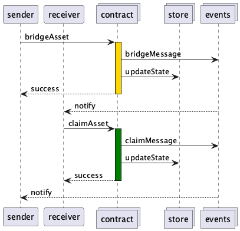

# Bridge Protocol TLA+ Model

This specification models the cross-chain bridging protocol in TLA+. It defines five “processes”:

- Sender – The first user initiating a bridge action.
- Receiver – The second user claiming the bridged asset.
- Contract – The smart contract that performs bridging and claim operations.
- Events – An event-management mechanism that notifies users about relevant actions.
- Store – A data store that is updated after each major contract action.

### Usage
- Open bridge.tla as a TLA+ specification (File → Open Spec).
- Create a new model (Model → New Model).
- Click “Check Model” to run the TLC model checker on the Spec.
